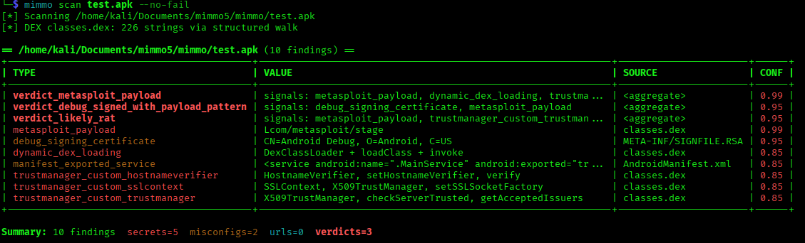
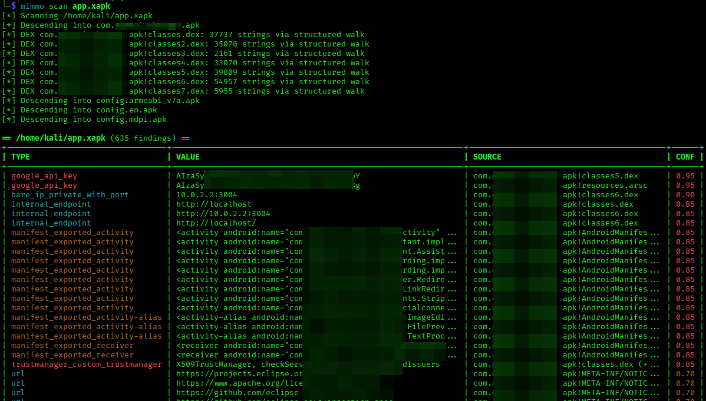
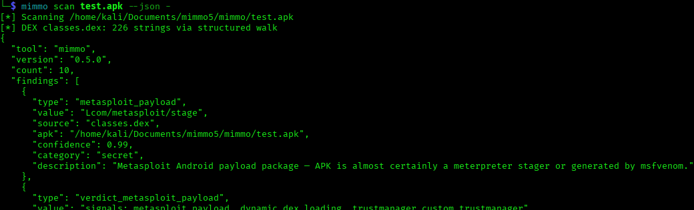

# **MIMMO**

### **Mobile Inspector for Misconfigurations & Metadata Observation**

A lightweight, dependency-free static analyzer for Android packages
(`.apk`, `.xapk`). For penetration testers and
AppSec engineers who want a fast very first-pass triage.

Pure Python 3.11+ standard library. No third-party dependencies.



### DISCLAIMER
#### *Use only on APKs you own or are explicitly authorized to analyze. The author is not liable for misuse. This tool is for defensive security research and authorized penetration testing.*
---

## Quick start

```bash
cd mimmo
pip install .

mimmo scan app.apk
```

That's it. You get a coloured table grouped by APK, plus a summary line.
Exit code is `1` if anything has confidence ≥ 0.85 (CI-friendly).

---

## What it finds

**Secrets** — vendor-specific patterns at high confidence:
AWS, Google API keys, GitHub PATs, Stripe, Slack, Twilio, SendGrid,
OpenAI, Anthropic, Hugging Face, DigitalOcean, Discord, Telegram,
Square, Mailchimp, Algolia, Heroku, Cloudflare, npm, PyPI, JWTs,
Bearer/Basic auth, AES key literals, PEM private keys, and key=value heuristics with **Shannon-entropy filtering**.

**Misconfigurations** — parsed from binary `AndroidManifest.xml`:
`debuggable=true`, `usesCleartextTraffic=true`, `allowBackup=true`,
`networkSecurityConfig` references, exported activities/services/receivers/providers
without permission, `grantUriPermissions=true`, debug signing certificate
(`CN=Android Debug`).

**Network exposure**: HTTP(S) URLs (with noise filtering), bare IPv4
addresses with optional `:port`, RFC1918/loopback/link-local internal
endpoints flagged separately, Firebase RTDB URLs, IPs recovered from
**raw DEX bytecode** (4 different operand layouts).

**Malware indicators - WORK IN PROGRESS**: Metasploit/Meterpreter package and method
markers, known RAT family fingerprints (AhMyth, SpyNote, DroidJack,
AndroRAT, Cerberus, Alien), reverse-shell method conventions, custom
`TrustManager` / `HostnameVerifier` patterns (MitM enablement),
runtime DEX loading via `DexClassLoader` + reflection (stager pattern).

**Aggregate verdicts**: when several malware indicators co-occur on
the same APK, MIMMO emits a high-confidence verdict at the top of the
report so you don't have to join the dots yourself.

---

## Usage

```bash
# Basic Help
mimmo -h

# Scan Help
mimmo scan -h

# Single APK
mimmo scan app.apk

# Recurse a directory
mimmo scan ./apks

# JSON output
mimmo scan app.apk --json report.json
mimmo scan app.apk --json - --no-table | jq '.findings[] | select(.confidence >= 0.9)'

# Custom CI threshold
mimmo scan app.apk --fail-on 0.95   # only fail on near-certain hits
mimmo scan app.apk --no-fail        # always exit 0

# Filter / configure
mimmo scan app.apk --min-confidence 0.85
mimmo scan app.apk --scan-native              # also scan .so files
mimmo scan big.apk --max-file-size 200000000  # raise per-file size cap

# Disable source collapsing (show every occurrence as a separate row)
mimmo scan app.apk --no-collapse
```

### Diagnostic mode: `inspect`

When `scan` reports fewer findings than you expect, dump every string
extracted from the APK to see what's actually inside:

```bash
mimmo inspect -h
mimmo inspect app.apk
mimmo inspect app.apk --filter-source classes.dex
mimmo inspect app.apk --grep '\d+\.\d+\.\d+\.\d+'
mimmo inspect app.apk --grep '(?i)(metasploit|meterpreter|payload|c2|lhost)'
```

Output is `SOURCE | KIND | STRING`, one line per string. Pipe to grep,
find what's there, then we can write a regex for it.

### Source collapsing

By default MIMMO collapses the same `(type, value)` across multiple
sources into a single finding:

```
| email | contact@corp.example | strings.xml (+47 more) | 0.70 |
```

The full source list is preserved in the JSON output (`sources` array),
so no evidence is lost. Manifest misconfigurations are never collapsed.

### Bundle formats

XAPK / APKM / APKS bundles are descended into automatically. Inner
splits show up in the `source` column with `outer.apk!inner_path`
notation:

```bash
mimmo scan myapp.xapk -v
# [*] Descending into base.apk
# [*] Descending into config.arm64_v8a.apk
# | google_api_key | AIzaSy... | base.apk!resources.arsc | 0.95 |
```

---
## Limitations

- **No DEX disassembly**: MIMMO reads the string table and raw bytes,
  not bytecode. Use `jadx` for control-flow analysis.
- **No `@string/...` resolution**: AndroidManifest references to
  `resources.arsc` IDs aren't resolved. The string-pool scan usually
  finds the values anyway.
- **No taint analysis / flow tracking**: this is a first-pass scanner.
  Findings indicate places worth verifying manually.
- **Encrypted/obfuscated payloads**: if LHOST is XOR'd or fetched from
  a second stage, no static analyzer recovers it. Verdicts cover this
  gap by aggregating surrounding signals.
- **Native libraries**: `.so` scanning is opt-in and string-only. No
  ELF parsing, no symbol analysis.
- **Obfuscated DEX**: ProGuard/R8 may rename identifiers. Secrets,
  URLs, and config blobs generally aren't obfuscated since they need
  to be readable at runtime.
---

## How it works

This section explains what MIMMO actually does inside, module by module.
If you just want to use the tool, you can skip it; if you want to extend
it or understand why it gives the answers it does, read on.

### High-level pipeline

```
APK file → Scanner.scan_path
            ↓
        ZIP walk (recursive into nested .apk for XAPK/APKM/APKS)
            ↓
        Per-member dispatch by file type
            ↓
        Detectors run on extracted text/strings
            ↓
        Findings → dedupe → collapse_sources → derive_verdicts → output
```

The scanner walks ZIP members and routes each to the right extraction
strategy. Extracted text is fed to all registered detectors. Findings
are then deduplicated, source-collapsed, and aggregated into verdicts
before being rendered as a table or JSON.

### File routing (`core.py`)

Each member of the ZIP is routed by name and content:

- **`AndroidManifest.xml`** → binary AXML parser → manifest detector
  (structured) + string-pool fallback. If AXML parsing fails (rare),
  a heuristic checks for `debuggable` + `true` co-occurrence.
- **`classes*.dex`** → structured DEX string-table walk + raw-bytecode
  IP recovery pass. Falls back to ASCII string scan on parse error.
- **`resources.arsc`** → ASCII + UTF-16LE string scan.
- **Text-like files** (`.json`, `.xml`, `.properties`, `.smali`, …) →
  UTF-8 decode → text detectors.
- **Nested `.apk`** (in XAPK/APKM/APKS) → recursive descent up to
  depth 2.
- **Native libs `.so`** → off by default, opt-in with `--scan-native`.

ZIP reads are guarded by `_safe_read` which streams the member through
`zf.open()` with a hard cap on **decompressed** bytes. This blocks
ZIP-bomb members that declare a small size in the header but expand to
gigabytes when read. ZIP member names are also sanitised (control
bytes, ANSI escapes, traversal segments) before going into reports —
an attacker can't poison your terminal table or smuggle
`../../../etc/passwd` into a consultant's PDF.

### AXML parser (`axml.py`)

`AndroidManifest.xml` is stored as binary AXML, not text. The parser
reads chunk headers (`<HHI` = type, header_size, size), walks the
string pool (handles both UTF-8 and UTF-16 length encoding), and emits
`Element` objects with their namespace-qualified attributes. We
implement just enough of the format to enumerate elements — no
resource ID resolution, no full ResTable parsing.

### DEX parser (`dex.py`)

Reads the DEX header (validates magic, endianness, `string_ids_size`
and `string_ids_off` bounds), then enumerates each `string_data_item`
via the offset table. ULEB128 length prefix is decoded; UTF-8 body is
read up to the terminating NUL. Strings are decoded with
`errors="replace"` rather than strict MUTF-8 — the few rare 0xC0 0x80
NUL-substitutions and surrogate-pair quirks aren't worth a custom
decoder.


### Detector registry (`detectors.py`)

Each detector subclasses `Detector` and decorates with `@register`.
The scanner picks them up automatically. The `Finding` dataclass is
frozen and hashable, with `dedup_key` and `collapse_key` methods.

Detectors fall into a few categories:

- **Pattern-based** (`SecretDetector`): vendor-specific regexes with
  built-in confidence scores. PEM blocks get post-processing to
  distinguish a full block from a header-only orphan or a
  split-at-runtime case (BEGIN/END adjacent in the string pool but
  body materialised elsewhere). Heuristic patterns (`hardcoded_credential`,
  `high_entropy_blob`) are filtered through a Shannon-entropy gate at
  3.5 bits/char to kill the obvious false positives.

- **Co-occurrence-based** (`TrustManagerBypassDetector`,
  `DynamicCodeLoadingDetector`): match when *all* of a set of
  signature strings appear in the same source. We can't see Java method
  bodies, only the names in the string table — but if all the names
  needed to roll your own permissive `TrustManager` are present, that's
  almost certainly what's happening. False-positive rate is very low.

- **File-targeted** (`DebugCertificateDetector`): only fires on
  `META-INF/*.RSA` (or `.DSA`/`.EC`), looks for the well-known
  `CN=Android Debug` subject. No X.509 parsing — just the substring.

- **Manifest-structural** (`ManifestDetector`): walks the parsed AXML
  elements and checks `<application>`, `<activity>`, `<service>`, etc.
  for known misconfigurations. Distinct from the others because it
  consumes structured data, not text.

- **Bytecode-level** (`_DexBytecodeIPDetector`): the only detector
  that operates on raw DEX bytes rather than extracted strings.
  Reverse-shell payloads (msfvenom, etc.) load LHOST as separate
  small-integer operands rather than as a String, so the IP is *never*
  in the string pool. We anchor on private-network 2-byte prefixes
  (`192.168`, `169.254`, `172.16`–`172.31`) using `bytes.find()`
  (C-speed) and verify four candidate layouts: contiguous quartet,
  stride-2 (const/16 immediates), stride-4 (const 32-bit), and the
  msfvenom-specific stride-4-with-opcode pattern.

### Verdict aggregation (`derive_verdicts` in `core.py`)

After dedup and collapsing, MIMMO checks whether *combinations* of
findings imply a high-level conclusion. Three rules currently fire:

| Verdict | Conditions | Confidence |
|---|---|---|
| `verdict_metasploit_payload` | MSF package + dynamic loading + custom TrustManager | 0.99 |
| `verdict_likely_rat` | Any malware-family marker + permissive TLS + dynamic loading | 0.95 |
| `verdict_debug_signed_with_payload_pattern` | Debug cert + any offensive pattern | 0.95 |

When all conditions for a rule are met on a single APK, a verdict
finding is added at the top of the report. Verdicts are useful when
individual values (LHOST, LPORT) can't be recovered statically because
they're encoded or downloaded by a second stage — the *picture* is
still unambiguous from the surrounding signals.

### Reporters (`reporters.py`)

Two outputs:

- **Table** (default): grouped by APK, sorted with verdicts first,
  then by descending confidence, then by type (stable across runs).
  ANSI colour coded by category, respects `NO_COLOR` env var. Long
  values are shortened to 60 chars in the cell — the JSON keeps the
  full value. 
  
- **JSON**: `{tool, version, count, findings: [...]}`. Each finding has
  `type`, `value`, `source`, `apk`, `confidence`, `category`,
  `description`. When source-collapsed, an additional `sources` array
  preserves all locations.

The JSON contains the **full** value (e.g. complete PEM blocks of
1500–3500 chars). Always pull from JSON for evidence in reports — the
table truncates for readability.


### Where findings are stored

**Nowhere by default.** `Finding` objects live in a Python list in
RAM and are written only to the targets you specify. No cache, no
temp files, no logs. Operationally:

- Findings appear in your terminal scrollback unless you redirect output.
  Mind that in shared/recorded sessions.
- For audit trails, use `--json file.json` and version-control it.

---

## Architecture

```
mimmo/
├── pyproject.toml         # entry point: mimmo = "mimmo.cli:main"
├── README.md
└── mimmo/
    ├── __init__.py        # __version__
    ├── __main__.py        # supports `python -m mimmo`
    ├── cli.py             # argparse, subcommands, exit-code policy
    ├── core.py            # Scanner, ZIP walker, dedup/collapse/verdicts
    ├── detectors.py       # Detector registry, all built-in detectors
    ├── axml.py            # Binary AndroidManifest.xml parser
    ├── dex.py             # DEX string-table parser
    ├── strings_util.py    # ASCII / UTF-16LE extraction from binaries
    ├── finding.py         # Frozen Finding dataclass
    └── reporters.py       # JSON + ANSI table writer
```

---

## Extending

Adding a new detector takes ~20 lines:

```python
# mimmo/my_detector.py
import re
from .detectors import Detector, register
from .finding import Finding

@register
class MyCorpDetector(Detector):
    name = "mycorp"
    category = "secret"
    _RE = re.compile(r"MYCORP-[A-Z0-9]{32}")

    def scan_text(self, text, source, apk):
        for m in self._RE.finditer(text):
            yield Finding(
                type="mycorp_token",
                value=m.group(0),
                source=source,
                apk=apk,
                confidence=0.95,
                category="secret",
                description="Internal MyCorp service token",
            )
```

Then `import mimmo.my_detector` once at startup — the registry picks
it up automatically.

For a verdict rule, add an entry to `_VERDICT_RULES` in `core.py`. For
a manifest check, override `scan_manifest` instead of `scan_text`.
Bye :D
